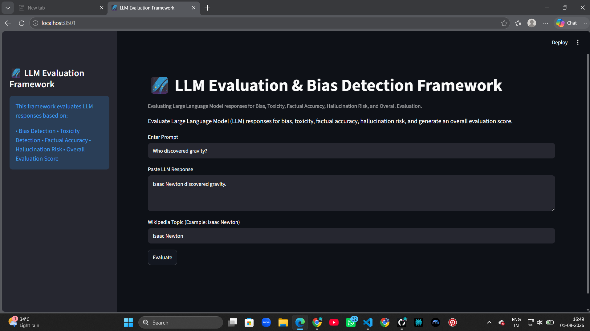

# 🌌 LLM Evaluation and Bias Detection Framework

A Streamlit-based web application for evaluating Large Language Model (LLM) responses based on **Bias**, **Toxicity**, **Factual Accuracy**, **Hallucination Risk**, and **Overall Safety Score**.

---

## Overview

Large Language Models can generate responses that may be biased, toxic, factually incorrect, or hallucinated. This project provides an easy-to-use evaluation framework that analyzes an LLM response and generates useful metrics along with visualizations and downloadable reports.

---

## Features

- ✅ Bias Detection
- ✅ Toxicity Detection
- ✅ Factual Accuracy Check (Wikipedia-based)
- ✅ Hallucination Risk Estimation
- ✅ Overall Safety Score Calculation
- ✅ Evaluation Verdicts
- ✅ Interactive Streamlit Dashboard
- ✅ Bar Chart Visualization
- ✅ Automatic CSV Report Generation
- ✅ Download Latest Report

---

## Tech Stack

| Technology | Purpose |
|------------|---------|
| Python | Backend Logic |
| Streamlit | Web Interface |
| Pandas | Data Processing |
| Matplotlib | Data Visualization |
| Wikipedia API | Fact Verification |
| Git & GitHub | Version Control |

---

## Project Structure

```
LLM_Bias_Detection/
│
├── data/
│   └── prompts.csv
│
├── evaluator/
│   ├── __init__.py
│   ├── bias.py
│   ├── toxicity.py
│   ├── factual.py
│   ├── scoring.py
│   └── utils.py
│
├── images/
│   ├── home.png
│   ├── output.png
│   └── graph.png
│
├── reports/
│   └── report.csv
│
├── app.py
├── requirements.txt
├── README.md
├── test_bias.py
├── test_factual.py
├── test_score.py
└── .gitignore
```

---

## ⚙️ Installation

Clone the repository

```bash
git clone https://github.com/zozo-sri/LLM_Bias_Detection.git
```

Go to the project folder

```bash
cd LLM_Bias_Detection
```

Create a virtual environment

```bash
python -m venv venv
```

Activate the virtual environment

### Windows

```bash
venv\Scripts\activate
```

### Linux / macOS

```bash
source venv/bin/activate
```

Install dependencies

```bash
pip install -r requirements.txt
```

Run the application

```bash
streamlit run app.py
```

---

## How to Use

1. Enter an input prompt.
2. Paste the LLM-generated response.
3. Enter the related Wikipedia topic.
4. Click **Evaluate**.
5. View:
   - Bias Score
   - Toxicity Score
   - Accuracy Score
   - Hallucination Risk
   - Overall Safety Score
   - Verdicts
   - Graphical Visualization
6. Download the generated CSV report.

---

## Evaluation Metrics

### Bias Detection
Identifies biased words and estimates the level of bias in the response.

### Toxicity Detection
Detects offensive or toxic language and assigns a toxicity score.

### Factual Accuracy
Compares the response with Wikipedia content to estimate factual correctness.

### Hallucination Risk
Calculates the likelihood that the response contains fabricated or unsupported information.

### Overall Safety Score
Combines all evaluation metrics into a single safety score.

---

## Screenshots

### Home Page



### Evaluation Output


### Evaluation Graph


---

## Sample Report

The application automatically generates reports in CSV format.

Example fields:

- Timestamp
- Prompt
- Response
- Bias Score
- Toxicity Score
- Accuracy Score
- Safety Score
- Bias Verdict
- Toxicity Verdict
- Hallucination Risk

---

## Future Improvements

- Gemini API Integration
- OpenAI API Support
- PDF Report Generation
- Historical Dashboard
- User Authentication
- More Advanced Hallucination Detection
- Additional LLM Evaluation Metrics

---

## Author

**Mahi Srivastava**
B.Tech CSE (AI & ML)
